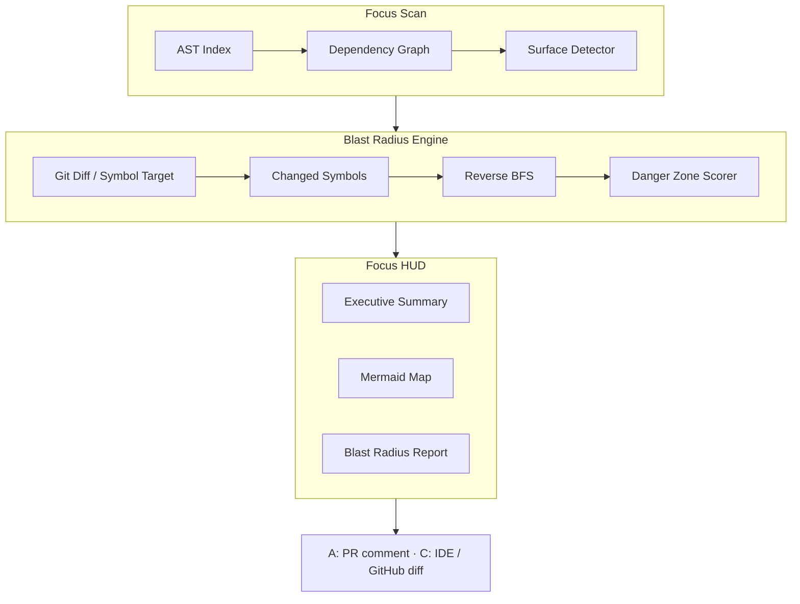

# Focus

**Blast radius you can defend — evidence-only, before you merge.**

When a senior asks *why* on an AI-assisted PR, “the model wrote it” isn’t an answer.  
Focus shows **what else that change touches** — with evidence you can point at in review.

---

## Who · What · When · Where · Why · How

| | |
|---|---|
| **Who** | Juniors shipping AI-assisted PRs, and seniors who have to review them — anyone who must **defend** a change |
| **What** | An evidence-only blast-radius HUD: import graph → Mermaid map + Danger Zones. No LLM inventing edges |
| **When** | Right before you push, and on every PR — the moment someone asks “what else breaks?” or “why this?” |
| **Where** | **A:** GitHub PR comment (full HUD). **C:** inline in the diff — IDE CodeLens + HUD panel, and GitHub review comments on changed lines (Phase 5 thin). **Not** committed `.md` files |
| **Why** | AI made teams faster at generating code and slower at shared understanding. The feedback loop breaks when the answer is silence |
| **How** | Parse the repo → dependency graph → reverse-BFS from the diff → quiet unless it matters. Same `FocusHUD` everywhere (`--format json` for the IDE) |

> Not another AI PR summary. Not a hop inventory that cries wolf on every file.

---

## Try in 60 seconds

```bash
pip install "focus-hud>=0.4.0"    # PyPI
# Or from this repo: git clone + uv sync (see below)

focus trace path/to/shared_module.py --out focus-hud.md
# open focus-hud.md → Markdown preview for Mermaid

focus audit --local --out focus-hud.md   # local preview only (gitignored — not committed)
focus audit --local --format json        # machine-readable HUD (IDE / tools)
```

`focus-hud.md` is a **scratch file** for local Mermaid preview. Focus does **not** ask you to commit HUD output — reviewers get **A** (PR comment) and **C** (inline in the diff).

**Demo fixture (no app required):**

```bash
git clone https://github.com/j0viane/focus.git && cd focus
uv sync
uv run focus trace tests/fixtures/glass_box/auth_utils.py \
  --root tests/fixtures/glass_box --out focus-hud.md
```

Gallery + walkthrough: [`docs/DEMO.md`](docs/DEMO.md) · [`docs/assets/`](docs/assets/)

---

## Where Focus shows up

| Surface | When | What you get |
|---|---|---|
| **A — PR comment** | Every PR (GitHub Action) | Full architecture HUD — summary, Mermaid, Danger Zones. Updates in place on new pushes |
| **C — IDE diff** | Before you push (Cursor / VS Code) | Edit-shaped ℹ️ on the change; **live while typing** (unsaved buffer); Save refresh; SCM Working Tree (right pane); full HUD map for risk / blast radius |
| **C — GitHub diff** | PR review (Phase 5 thin) | Batched inline review comments on **changed lines** (edit-shaped ℹ️, ROA-capped) — companion to the PR comment; blast radius stays in **A** |
| ~~**B — git**~~ | — | **Not supported** — no committed `focus-hud.md` |

Same evidence everywhere: parse → graph → `FocusHUD` → renderer (markdown comment, webview, CodeLens, GitHub inline review).

---

## In Cursor / VS Code (diff-first · surface C)

Edit-shaped ℹ️ on the change you're looking at, plus the full HUD panel — blast radius **in the diff you're editing**. Risk / who-breaks lives in the **HUD** (and PR comment), not as a second CodeLens on `def`.

**What it looks like in the editor** (virtual UI — nothing written to git):

```text
    def pack_fingerprint(pack: CaptionEvidencePack, *, model: str) -> str:
        """Hash pack JSON + model + prompt rev so matching captions reuse the cache."""
        payload: dict[str, Any] = {
            "model": model,
            ℹ️ The pack_fingerprint function now includes the prompt revision in its
               hash so callers reuse cached captions when the pack matches.
            "prompt_rev": _PROMPT_REV,
            "pack": pack.model_dump(mode="json"),
        }
        return hashlib.sha256(...).hexdigest()
```

ℹ️ sits on the **body edit** (not the docstring when both changed). It names **what changed and why it matters** — return / call / import / assign / blank count / ledger scope (module + class constants) — not a static slogan. Typer CLI commands can surface `@app.command` / `Option` help when the docstring is thin. A second ℹ️ appears only when two edit blocks teach **different** outcomes.

| Surface | Where | What |
|---|---|---|
| **ℹ️ Caption** | Above the primary edit (or each distinct outcome) | What this edit does + so-that when the pack supports it |
| **Trust cues** | Hover highlighted code, or click ℹ️ | *Why trust this* — ≤2 cues (map in HUD). Don’t rely on CodeLens title hover on macOS. |
| **HUD panel** | Focus: Show HUD / Audit Local | Full Mermaid + Danger Zones + risk / implication |

```bash
./scripts/install-extension.sh
```

(Needs `focus-hud` on PATH — the script installs the editable package too.)

Open the **repo git root**, set `focus.path` if needed, **Reload Window** once, and run **Focus: Audit Local Changes**. After that:

- **Live while typing** — dirty buffers refresh ℹ️ after a short debounce (`focus.liveBufferOverlay`, default on). No Save required.
- **Save** still re-audits from disk (`focus.autoAuditOnSave`).
- **Opt-in LLM ℹ️** — `focus.llmCaptions` (off by default): on **Audit Local**, wait for pack-constrained captions on the **open file** before painting, then label the rest in the background. Never on live overlay. Local dogfood: Ollama + `qwen2.5-coder:3b` (see extension README / [`docs/PRIVACY.md`](docs/PRIVACY.md)).

Details: [`extensions/vscode-focus/README.md`](extensions/vscode-focus/README.md).

| Moment | Command | You get |
|---|---|---|
| AI rewrote a shared function | Edit (live) or **Save** / **Focus: Audit Local** | **C** — ℹ️ on the edit; open HUD for risk / map |
| Big PR in your queue | Focus Action comment | **A** — diagram + Danger Zones on the PR |
| Inherited a module | `focus trace path/to/file.py` | Downstream map for one file |

---

## GitHub Action (surfaces A + C · any repo)

Copy [`examples/focus-action.yml`](examples/focus-action.yml) → `.github/workflows/focus.yml`.  
On every PR open/sync, Focus posts (and updates):

- **A** — a HUD **comment** (summary, Mermaid, blast radius)
- **C** — batched **inline review comments** on changed lines (edit-shaped ℹ️; skip on pass-through; cap 8)

Nothing is committed to the tree. Details: [`docs/ACTION.md`](docs/ACTION.md). Permissions: `contents: read` + `pull-requests: write` only ([`docs/PRIVACY.md`](docs/PRIVACY.md)).

> **Honesty:** Surface **C** needs a `focus-hud` build that includes `focus.ci.post_review_from_env` (Phase 5). On PyPI **0.4.0** today you get **A** only — use this checkout / next release for **C**, or omit the two JSON/inline steps in the drop-in workflow.

---

## Getting started (from this repo)

```bash
git clone https://github.com/j0viane/focus.git
cd focus
uv sync
uv run focus scan .
uv run focus trace src/focus/models.py --out focus-hud.md
uv run focus audit --local
```

Unchanged files reuse **`.focus-cache/`** (gitignored). Pass `--no-cache` to force a full re-parse.

Optional: copy [`.focus.toml.example`](.focus.toml.example) → `.focus.toml` to tune `fan_out_threshold` (default **3**).

Requirements: Python 3.12+. **PyPI:** `pip install "focus-hud>=0.4.0"`. **This checkout:** `uv sync` → same **0.4.0** line. Publish notes: [`docs/PUBLISH.md`](docs/PUBLISH.md).

```bash
uv run pytest
```

---

## Why "Focus"?

The name comes from *Horizon Zero Dawn*. Aloy navigates an inherited world with her **Focus** — an AR device that reveals weak points and danger ahead. A legacy codebase is the same kind of world. This Focus scans it so you change it with intel, not blind faith.

*Horizon Zero Dawn and Aloy belong to Guerrilla Games — no affiliation, just admiration.*

---

## Architecture



| Layer | Technology |
|---|---|
| CLI | Python 3.12+ / Typer (`--format markdown\|json`) |
| AST | Python `ast` + Tree-sitter (JS/TS) |
| Graph | NetworkX |
| Diagrams | Mermaid (GitHub + IDE webview) |
| CI | Opt-in GitHub Action — PR comment (A) + inline review comments on changed lines (C, Phase 5 thin) |
| IDE | VS Code / Cursor — CodeLens + HUD panel (C); extension **0.6.0** |
| LLM (opt-in) | Pack-only ℹ️ labels — never invents graph edges; off by default |

---

## Commands

| Command | Purpose |
|---|---|
| `focus scan [path]` | Index the repo (Python + JS/TS) |
| `focus trace [file]` | HUD for one file (`--format json` for tools) |
| `focus audit --local` | Working tree vs `main` |
| `focus audit --base <sha>` | PR / branch range |
| `focus audit --local --llm-captions` | Opt-in pack-constrained LLM ℹ️ (Ollama or cloud key) |
| `focus audit --local --llm-captions --llm-path <rel>` | Label the open/visible file first (faster dogfood) |
| `focus version` | Installed version |

---

## Roadmap

Phase 3 **complete**. Phase 4 IDE **C** shipping (edit-shaped ℹ️ + live buffer + SCM Working Tree; risk / implication in HUD). Phase **4b core complete** — symbol-proven downstream counts, why-this-edge import jump (#37), JSDoc/TSDoc caption extraction (#38), ROA hard caps enforced (dynamic-import hints parked to Explore). Phase **4c/4d** on PyPI **0.4.0**: opt-in evidence-pack LLM captions + portable edit ledger + caption sweet-spot (extension **0.6.0**). Phase **5 thin slice** — GitHub batched inline review comments on changed lines (beside the **A** PR comment; check-run annotations still Explore). See [`docs/ROADMAP.md`](docs/ROADMAP.md).

---

## Ethics & privacy

- **Evidence-based** — no LLM inventing edges, nodes, or risk tiers
- **Privacy-by-design** — respects `.gitignore`; default path sends **no** source to model APIs
- **Opt-in caption labels only** — when enabled, a capped `CaptionEvidencePack` (not full files / not the full graph); never on live overlay
- **No surveillance** — structure, not developer identity
- **Opt-in Action** — minimum token scope

Details: [`docs/ETHICS.md`](docs/ETHICS.md) · [`docs/PRIVACY.md`](docs/PRIVACY.md).

---

## Docs

| Doc | Contents |
|---|---|
| [`docs/DEMO.md`](docs/DEMO.md) | Walkthrough + gallery |
| [`docs/LAUNCH.md`](docs/LAUNCH.md) | Product Hunt / Show HN drafts |
| [`docs/ACTION.md`](docs/ACTION.md) | Action install |
| [`docs/HUD.md`](docs/HUD.md) | HUD schema + JSON contract |
| [`docs/ETHICS.md`](docs/ETHICS.md) | Responsible use |
| [`docs/PRIVACY.md`](docs/PRIVACY.md) | Data boundaries |

---

## License

[MIT](LICENSE) © 2026 Joviane Bellegarde.

## Author

[Joviane Bellegarde](https://github.com/j0viane). Feedback welcome via Issues.
