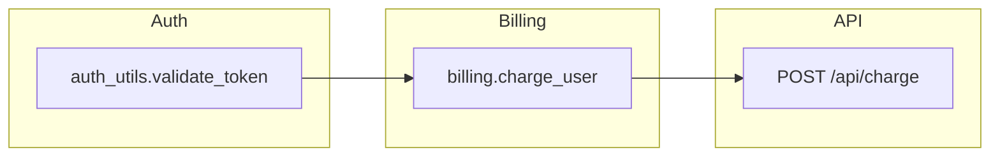

# Focus — HUD Schema (Frozen)

Canonical output contract for CLI stdout, PR comments, and example output. **Do not change without updating tests and `focus.mdc`.**

**Last updated:** July 2026  
**Status:** Frozen for Phase 1

---

## Modes

| Mode | When | Blocks |
|---|---|---|
| **Full HUD** | Smart trigger → diagram | All 4 blocks below |
| **Pass-through** | Low-impact change | Block 1 only (1 sentence) |
| **Error** | Parse failure, empty graph | Block 1 + optional Block 4 caveat |

---

## Block 1 — Executive Summary

**Required:** always  
**Max length:** 2 sentences

Must include:
- What changed (seed symbols or files)
- Risk tier: `LOW` | `MEDIUM` | `HIGH` | `CRITICAL`
- Optional **domain clause** (Phase 6): `touches **{label}**` when `.focus.toml` `[domains]` matches a seed/Danger Zone (or quiet billing/auth convention). At most one clause; silence when unmapped.

**Example (full HUD):**

> Modified `validate_token` in `auth_utils.py`. **HIGH** risk — shared auth utility with downstream API and billing dependencies.

**Example (pass-through):**

> **Focus:** Updated `docs/README.md` only — no executable code dependencies detected. **LOW** risk.

---

## Block 2 — Visual Dependency Map

**Required:** full HUD only  
**Format:** Mermaid fenced code block (`flowchart LR` or `flowchart TB`)

Rules:
- Max **15 nodes**; collapse by package/layer when exceeded
- Every edge must exist in computed graph JSON
- Node IDs = symbol or module paths (LLM may add human label in node text)
- Use `subgraph` for layers (e.g., auth, billing, api)
- **Role colors** (presentation only — not new topology): Mermaid `classDef` — **seed** (changed), **danger** (Danger Zone), **downstream** (blast radius). Markdown legend under the diagram names the colors.

**Example:**



---

## Block 3 — Blast Radius Report

**Required:** full HUD only  
**Format:** bulleted list with tier emojis

```markdown
🔴 **Danger Zones**
- `POST /api/charge` — API route in blast radius (2 hops from seed)
- `billing.charge_user` — high fan-out consumer

🟡 **Impacted Downstream**
- `dashboard.views.render` ← `auth_utils.validate_token` (3 hops)

🟢 **Isolated / Low Risk**
- (none for this change)
```

Tier rules: see [`TRIGGERS.md`](TRIGGERS.md) and [`ETHICS.md`](ETHICS.md).

---

## Block 4 — Analysis Caveat

**Required:** when static analysis coverage is partial  
**Optional:** omit when confidence is full

Default text (frozen):

> **Caveat:** Static analysis only. Runtime imports, dynamic dispatch, and cross-repo dependencies may not appear in this graph.

Append specific blindspots when detected (e.g., `importlib`, `eval`, star imports).

---

## Machine-readable schema (Pydantic + CLI JSON)

Implemented as `FocusHUD` in `src/focus/models.py`. CLI:

```bash
focus trace path/to/file.py --format json
focus audit --local --format json
```

Emits `FocusHUD.model_dump(mode="json")` — the VS Code / Cursor extension consumes this (do not scrape markdown).

| Field | Type | Notes |
|---|---|---|
| `mode` | `full` \| `pass_through` \| `error` | Smart-trigger outcome |
| `seed` | string | Primary file / symbol seed |
| `summary` | string | Block 1 |
| `risk_tier` | `LOW` \| `MEDIUM` \| `HIGH` \| `CRITICAL` | |
| `mermaid` | string \| null | Block 2 source |
| `danger_zones` | `ImpactNode[]` | path, hops, reason, `import_evidence` |
| `downstream` | `ImpactNode[]` | |
| ↳ `import_evidence` | `ImportEvidence[]` | `{path, line, module}` — proving `import` line(s) for direct (hop-1) edges + the changed seed's importers; empty for transitive (hop ≥ 2). Deterministic (from parser); IDE "why this edge" jump target |
| `isolated` | string[] | |
| `changed_symbols` | `ChangedSymbolInfo[]` | audit only |
| `caveat` | string \| null | Block 4 |

---

## Pass-through template

No blocks 2–4. Single line or short paragraph:

```markdown
**Focus:** {one sentence}. **{RISK_TIER}** risk.
```

---

## PR comment wrapper

```markdown
## Focus

{Block 1}

<!-- full HUD only -->
### Your changes
{up to 8 changed symbols; overflow points to IDE / `focus audit --format json`}

### Architecture impact
{Block 2 mermaid fence}

### Blast radius
{Block 3 — Danger Zones uncapped; Also affected / Not pulled in capped at 8 + overflow}

{Block 4 if present}

---
<sub>Generated by Focus · [docs](https://github.com/jovianebellegarde/focus)</sub>
```

### ROA caps (surface A)

PR / CLI markdown must stay scannable on large diffs (`render_hud` in `src/focus/hud/render.py`):

| Section | Cap | Overflow |
|---|---|---|
| **Your changes** | 8 symbols (Danger Zone paths + public names first; `_` helpers last) | `…and N more changed symbols (see IDE CodeLens or focus audit --format json)` |
| Bullet blurb | Prefer `detail` / `summary` over long `explanation`; clip ~110 chars | — |
| **Also affected** / **Not pulled in** | 8 each | `…and N more` |
| **Danger Zones** | uncapped (usually few) | — |
| Mermaid | 15 nodes (unchanged) | collapse by package |

Full inventory stays in IDE CodeLens and `--format json`.

---

## Surface C — GitHub inline review comments (Phase 5 thin slice)

Same `FocusHUD` — **no new schema**. CI runs `focus audit --format json` and posts a batched PR review (`event: COMMENT`) whose inline comments reuse already-computed captions:

| Source field | Anchor |
|---|---|
| `changed_symbols[].hunk_details[].detail` | `hunk_details[].line` (`side: RIGHT`) |
| `line_explanations[].detail` | `line_explanations[].line` (`side: RIGHT`) |

Rules (`src/focus/ci/github_review.py`):

- Skip entirely when `mode == "pass_through"`
- Cap at `FOCUS_INLINE_MAX` (default **8**); danger-zone / public symbols first (same order as Surface A)
- Never anchor on `ChangedSymbolInfo.line` (the `def` can sit outside the diff)
- Bodies include `<!-- focus-line -->` so re-runs delete + replace instead of stacking
- Blast radius / downstream stays in Surface **A** (unchanged files cannot take review comments)

See [`ACTION.md`](ACTION.md).

---

## Related documents

- [`TRIGGERS.md`](TRIGGERS.md) — full vs pass-through
- [`TESTING.md`](TESTING.md) — golden expected HUD strings
- [`PRIVACY.md`](PRIVACY.md) — what never appears in HUD (secrets)
